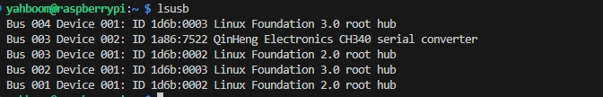
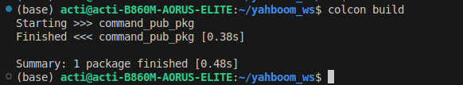

# Voice commnad 
This repository is build with ROS2.

该模块是基于yahboom智能语音模块搭建的ROS2节点，能够实现智能语音对话以及通过ROS2 topic输出结果

## 环境配置

首先，把语音模块插到上位机，查看usb是否连接。
```
lsusb
```


当输出QinHeng的选项时候就证明已经连接上了。

接下来需要新建一个规则文件，终端中输入
```
sudo gedit /etc/udev/rules.d/my_speech.rules
```

将下面的文本输入到里面

```
KERNEL=="ttyUSB*",ATTRS{idVendor}=="1a86",ATTRS{idProduct}=="7522",MODE:="0777",SYMLINK+="myspeech"
```

保存后需要更新规则，输入下面的指令：
```
sudo udevadm trigger
sudo service udev reload
sudo service udev restart
```


当输出这些信息的时候证明已经更新完成了

## 节点编译

该节点是在Ubuntu22.04 ROS2 Humble下进行编译的，其他的还没有经过测试。按照教程下载并安装ROS2 Humble，可以参考[鱼香ROS](https://blog.csdn.net/m0_73745340/article/details/135281023)进行下载安装。

安装完成后，创建自己的工作空间，
```
mkdir -p ~/my_ws/src
cd ~/my_ws/src
```

将项目克隆下来，放到src路径下。

```
git clone https://github.com/yangzhongii/command_pub_pkg
```

完成项目下载后，使用colcon进行编译

```
cd ../
colcon build
```



当输出图片中的信息证明已经编译完成了

## 节点启动

在工作空间下，使用下面指令

```
source install/setup.bash
ros2 run command_pub_pkg command_pub
```

输入后便可以完成节点的启动

## 节点监听

终端中输入下面指令可以监听节点

```
ros2 topic echo /voice_command
```

由于项目没有具体场景，县使用str字符串的形式将节点信息输出。


